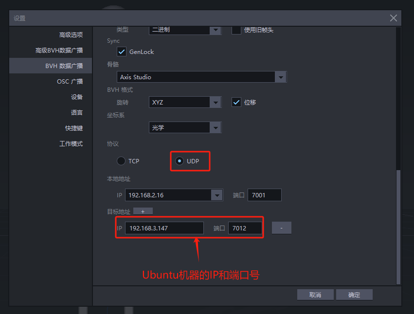

1. Windows电脑上打开Axis Studo，设置->BVH数据广播对话框里，选择UDP，添加目标地址： IP填写ubuntu的IP，端口：7012

   

2. 启动URDF模型

  

3. Ubuntu环境，源码编译
    前提：登录ubuntu系统（g++编译环境），将文件复制到目录下
    将noitom_cpp 拷贝到ros系统下

  ~~~
  cd noitom_ros2_cpp
  ln -s librobotapi_x86-64.so libMocapApi.so
  colcon build
  source install/setup.bash
  chmod +x lunch.sh 
  ./lunch.sh
  ~~~

  ros中的urdf模型将跟着axis studio动作运动