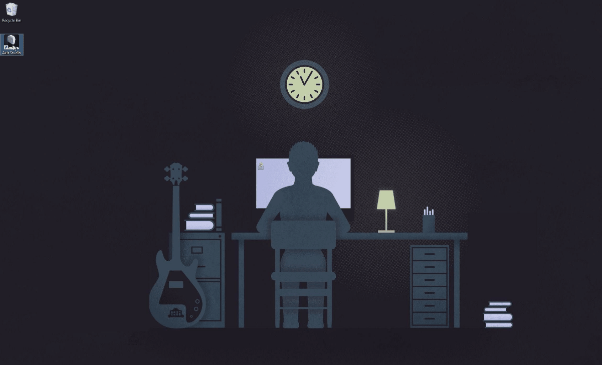
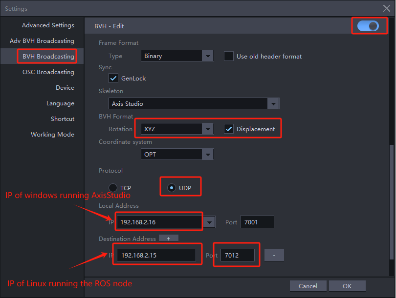

# Introduction

This project is a ROS node program implemented in C++, which achieves the following functions:

1. First, obtain human motion data (in BVH format) from the Noitom Mocap Software.

2. Then, convert the BVH data into data corresponding to the robot joint model. This step is called Retargeting.

   > Currently, retargeting for the H1 model robot of Unitree Technology is supported.

3. Finally, send the converted data to the simulation emulator node to drive the robot model.

   > In addition to driving the robot model, it can also drive a TF model (stickman has the same skeletal structure as a real human).

When combined with the project of the simulation emulator node, it can achieve the function of obtaining data from the Noitom Mocap Software and using it to drive the robot.

The following figure shows the data flow of each node:


- **Noitom Mocap Software**: Noitom Company provides professional motion capture software (such as Axis Studio, Hybrid Data Server, etc.), which is responsible for providing motion capture data based on real human bodies.

  > please contact info@noitom.com

- **mocap_ros_py**:  A ROS node program implemented in Python. It retrieves data from the Noitom Mocap Software. After retargeting, it sends the data to the simulator to drive the robot model. Alternatively, it can directly send the BVH data to drive the TF model(stickman). 

  > source code: https://github.com/pnmocap/mocap_ros_py.git

- **mocap_ros_cpp**: This project. It has the same function as mocap_ros_py, but it is implemented in C++. 

  > source code: https://github.com/pnmocap/mocap_ros_cpp.git

- **mocap_ros_urdf**: A robot simulation emulator, listens to the data from mocap_ros_py or mocap_ros_urdf and drives the robot.

  > source code:  https://github.com/pnmocap/mocap_ros_urdf.git


# File Structure

| Item            | Description                                                         |
| --------------- | ------------------------------------------------------------ |
| lib/            | It includes the `librobotapi` dynamic library files for various CPU architectures. This library provides interface functions to obtain motion capture data from Axis Studio and also encapsulates the functionality of converting BVH data to the URDF format.  |
| img/            | It contains the images used in this instruction document.                                 |
| unitree_h1/     | It stores the retargeting configuration files for the Unitree Technology H1 model. |
| noitom_ros1_cpp/| Source code of the node project for the ROS1 |
| noitom_ros2_cpp/| Source code of the node project for the ROS2 |
| README.md       | Readme in Chinese                                            |
| README_en.md    | Readme in English                                            |

# Launch Steps

## Prerequisites

- First, find a Windows PC, install the Axis Studio software, and complete the configuration.
- Second, find a Linux PC and install the ROS environment. (Either ROS 1 or ROS 2 is acceptable.)
- Depending on whether it is a ROS 1 or ROS 2 environment, start the corresponding simulation emulator node. For details, refer to: [mocap_ros_urdf](https://github.com/pnmocap/mocap_ros_urdf.git).
- Depending on whether it is a ROS 1 or ROS 2 environment, start the corresponding ROS node.

## Download This Project

Log in to the Linux PC with ROS installed, download this project.

~~~
git clone https://github.com/pnmocap/mocap_ros_cpp.git
~~~


## Configure the Motion Capture Software: Axis Studio

The latest generation of motion capture software supports the Perception Neuron Studio and Perception Neuron3 (Pro) motion capture products. Please refer to the official website of Noitom Company for more information.

### Start *Axis Studio* and Open a Motion Data File

At this point, you can see the 3D model in Axis Studio moving, as shown in the following figure:

   [](img/launch_axis_studio.gif)

### Configure *BVH Broadcasting*

Open the settings dialog box, select BVH Broadcasting and enable it:

Fill in the "Local Address" with the IP address of the Windows computer running the Axis Studio software, and fill in the "Destination Address" with the IP address of the Linux computer running the ROS node. Note that you need to fill in the local area network IP address, not a loopback IP like 127.0.0.1.

For the rest of the parts within the red frame, you need to fill them in strictly as shown in the figure.




## Start and Configure the Simulation Emulator Node

The ROS URDF model used here is the H1 robot model from Unitree Technology.

Please follow the description in the documentation to start and configure the simulation emulator node program: https://github.com/pnmocap/mocap_ros_urdf.git.

> set to RobotModel

## Start This ROS Node Program

precondition：Log in to the Linux PC with ROS installed and g++ environment installed

- install `nlohmann_json` 

~~~
sudo apt-get update
sudo apt-get install nlohmann-json3-dev
~~~

### ROS1

1. Create a workspace named `catkin_noitom` in the home directory.

> The following commands only need to be executed once.

~~~
mkdir -p ~/catkin_noitom/src   
cd ~/catkin_noitom/             
catkin_make                 
cd src                                         
catkin_create_pkg noitom_ros1_cpp
mv  noitom_ros1_cpp  ~/catkin_noitom/src/
~~~

2. Copy the retarget.json file corresponding to the URDF and the .so file corresponding to the operating system to the noitom_ros1_cpp workspace.

~~~
cp -r unitree_h1/retarget.json ~/catkin_noitom/src/noitom_ros1_cpp/retarget.json

cp -r librobotapi_x86-64.so  ~/catkin_noitom/src/noitom_ros1_cpp/libMocapApi.so
or 
cp -r librobotapi_arm64.so  ~/catkin_noitom/src/noitom_ros1_cpp/libMocapApi.so
~~~

3. CMake

```sh
cd  ~/catkin_noitom
catkin_make
source devel/setup.bash
```

4. launch the node

~~~
cd  ~/catkin_noitom/src/noitom_ros1_cpp/
chmod +x launch.sh 
./launch.sh
~~~

### ROS2

1. Copy the retarget.json file corresponding to the URDF and the .so file corresponding to the operating system to the noitom_ros1_cpp workspace.

~~~
cp -r unitree_h1/retarget.json noitom_ros2_cpp/retarget.json

cp -r librobotapi_x86-64.so noitom_ros2_cpp/libMocapApi.so
or 
cp -r librobotapi_arm64.so noitom_ros2_cpp/libMocapApi.so
~~~

2. colcon build

~~~
cd noitom_ros2_cpp
colcon build
source install/setup.bash
~~~

3. launch the node

~~~
cd noitom_ros2_cpp
chmod +x launch.sh 
./launch.sh
~~~

The robot model in the simulation emulator will move following the model in Axis Studio.