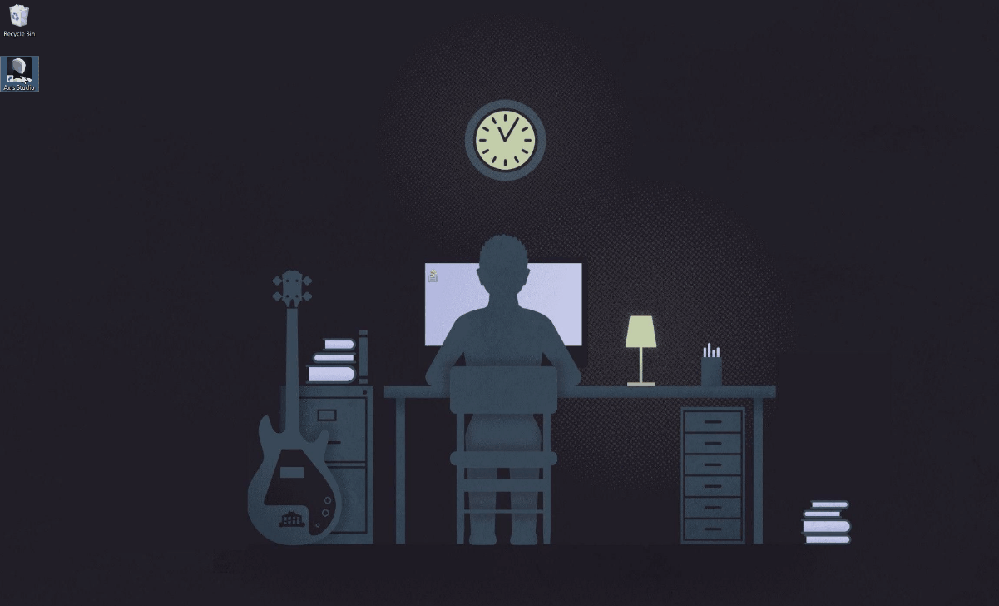
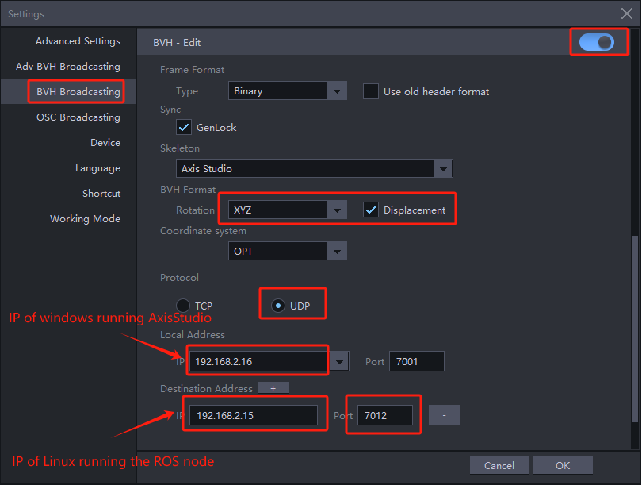

# 介绍

本工程是基于C++实现的ROS节点程序，实现下列功能：

1. 首先，从Noitom动捕软件获取人体动作数据（BVH格式）

2. 然后，将BVH数据转换成对应机器人关节模型的数据，该步骤称之为Retargeting

   > 目前支持宇树科技的H1模型机器人的retargeting

3. 最后，再把转换后的数据发送给仿真模拟器节点，用于驱动机器人模型。

结合仿真模拟器节点的工程，可以实现从Noitom公司提供的动捕软件获取数据并驱动机器人的功能。

下图展示了各个节点的数据流：


- **Noitom Mocap Software**：Noitom公司提供专业的动捕软件（如Axis Studio，Hybrid Data Server等），负责提供基于真实人体的动捕数据

  > 请联系info@noitom.com获取

- **mocap_ros_py**：基于python实现的ROS节点程序，从动捕软件获取数据，retargeting后发送给仿真器。

  > 工程源码：https://github.com/pnmocap/mocap_ros_py.git

- **mocap_ros_cpp**：本工程，功能同mocap_ros_py，基于cpp实现。

  > 工程源码：https://github.com/pnmocap/mocap_ros_cpp.git

- **mocap_ros_urdf**：机器人仿真模拟器节点工程，监听来自mocap_ros_py或mocap_ros_urdf的数据，驱动机器人

  > 工程源码：https://github.com/pnmocap/mocap_ros_cpp.git


# 目录结构

| 条目            | 说明                                                         |
| --------------- | ------------------------------------------------------------ |
| lib/            | 包含了针对各个CPU架构的librobotapi动态库文件，它提供了接口函数，从Axis Studio获取动捕数据，同时也封装了从BVH数据转换为URDF格式的功能。 |
| img/            | 包含了本说明文档中用到的图片                                 |
| unitree_h1/     | 存放针对宇树科技H1模型的regarting配置文件                    |
| noitom_ros1_cpp/| 针对ROS1环境的节点工程源码                                   |
| noitom_ros2_cpp/| 针对ROS2环境的节点工程源码                                   |
| README.md       | 本说明文档                                                   |
| README_en.md    | 英文版说明文档                                                   |

# 启动步骤

## 前提

- 首先找一台windows PC，安装好Axis Studio软件，并做好配置。
- 其次找一台linux PC，安装好ROS环境。（ROS1或ROS2都可以）
- 根据ROS1还是ROS2环境，启动对应的仿真模拟器节点，详见： [mocap_ros_urdf](https://github.com/pnmocap/mocap_ros_urdf.git)
- 根据ROS1还是ROS2环境，启动对应的ROS node

## 下载本工程

登录安装了ROS的linux PC，下载本工程

~~~
git clone https://github.com/pnmocap/mocap_ros_cpp.git
~~~


## 配置动捕软件Axis Studio

最新一代的动作捕捉软件支持 Perception Neuron Studio 和 Perception Neuron3（Pro）动作捕捉产品。请访问公司官网获取下载地址。

### 启动*Axis Studio*, 打开一个动作数据文件

此时能看到Axis Studio里的3D模型在运动，如下图所示：

   

### 配置 *BVH Broadcasting*

打开设置对话框，选择BVH Broadcasting并使能：

其中Local Address填写运行Axis Studio软件的windows电脑IP，Destination Address填写运行ROS节点的Linux电脑IP。注意需要填写局域网IP，不要填写127.0.0.1这种回环IP。

其余红框部分，需要严格按照图示填写。




##  启动并配置仿真模拟器节点

这里的ROS URDF模型使用的是宇树科技的H1机器人模型。

请按照文档描述，启动并配置好仿真模拟器节点程序： https://github.com/pnmocap/mocap_ros_urdf.git。

> 设置为RobotModel方式

## 启动本ROS节点程序

前提：登录ubuntu系统（g++编译环境），将文件复制到目录下

- 安装 `nlohmann_json` 库 

~~~
sudo apt-get update
sudo apt-get install nlohmann-json3-dev
~~~

### ROS1

1. 家目录下创建工作空间catkin_noitom

> 下列指令只需执行一次

~~~
mkdir -p ~/catkin_noitom/src   
cd ~/catkin_noitom/             
catkin_make                 
cd src                                         
catkin_create_pkg noitom_ros1_cpp
mv  noitom_ros1_cpp  ~/catkin_noitom/src/
~~~

2. 将对应urdf的retarget.json文件和操作系统对应的so文件copy到noitom_ros1_cpp工作空间

~~~
cp -r unitree_h1/retarget.json ~/catkin_noitom/src/noitom_ros1_cpp/retarget.json

cp -r librobotapi_x86-64.so  ~/catkin_noitom/src/noitom_ros1_cpp/libMocapApi.so
or 
cp -r librobotapi_arm64.so  ~/catkin_noitom/src/noitom_ros1_cpp/libMocapApi.so
~~~

3. 运行CMake

```sh
cd  ~/catkin_noitom
catkin_make
source devel/setup.bash
```

4. 编译好ROS包后，使用以下命令运行节点

~~~
cd  ~/catkin_noitom/src/noitom_ros1_cpp/
chmod +x launch.sh 
./launch.sh
~~~

### ROS2

1. 将对应urdf的  retarget.json  文件和操作系统对应的so文件copy到noitom_ros2_cpp 工作空间

~~~
cp -r unitree_h1/retarget.json noitom_ros2_cpp/retarget.json

cp -r librobotapi_x86-64.so noitom_ros2_cpp/libMocapApi.so
or 
cp -r librobotapi_arm64.so noitom_ros2_cpp/libMocapApi.so
~~~

2. 运行 colcon build

~~~
cd noitom_ros2_cpp
colcon build
source install/setup.bash
~~~

3. 编译好ROS包后，使用以下命令运行节点

~~~
cd noitom_ros2_cpp
chmod +x launch.sh 
./launch.sh
~~~

仿真模拟器中的机器人模型将跟着axis studio里的模型运动